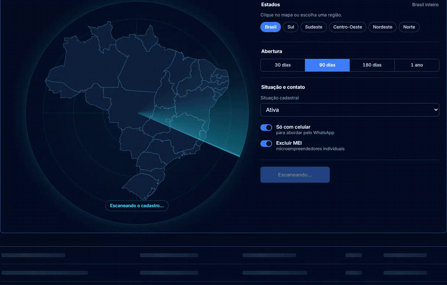
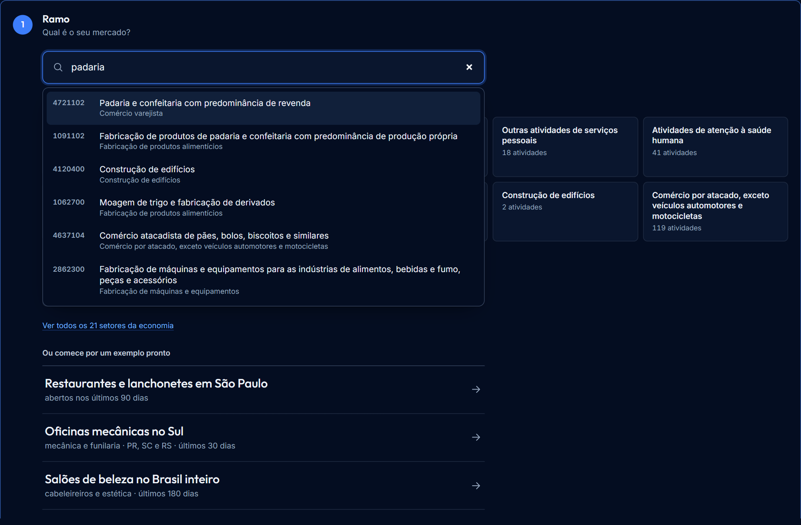
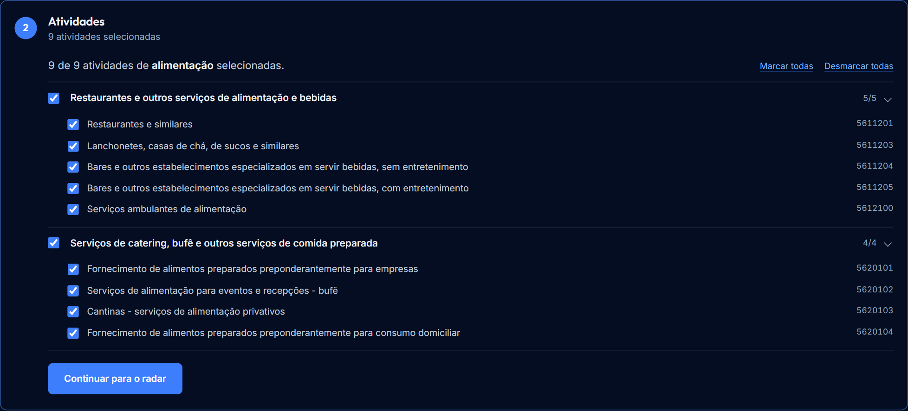
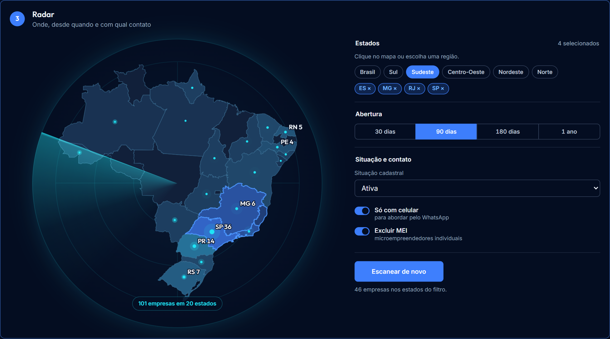
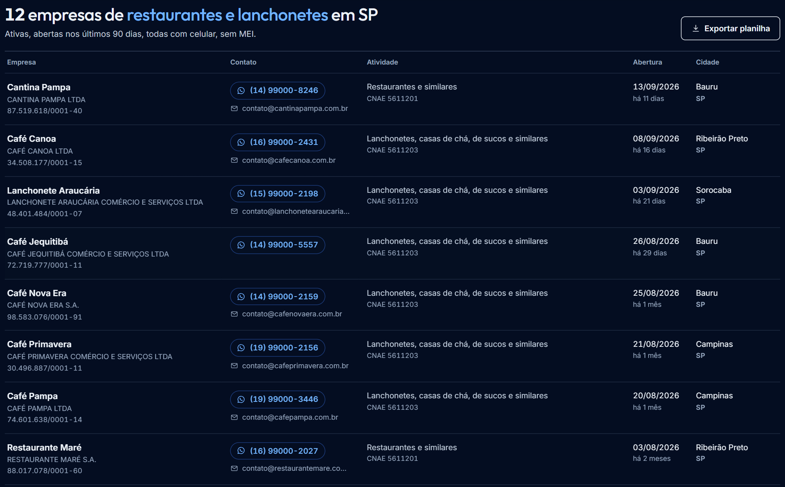
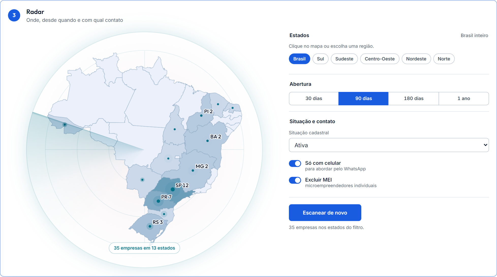
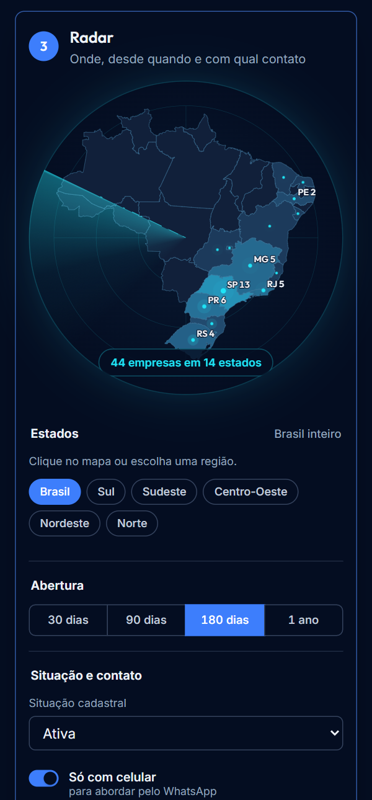
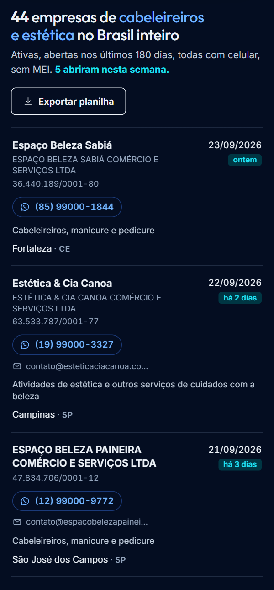

<p align="center">
  
</p>

<h1 align="center">Fonteca</h1>

<p align="center"><strong>Dados oficiais. Decisões melhores.</strong></p>

<p align="center">
  Encontre as empresas que acabaram de abrir no seu mercado, direto do cadastro
  público da Receita Federal, na sua própria máquina.
</p>

<p align="center">
  <a href="LICENSE"></a>
  <a href="https://github.com/magoautomacoes/fonteca/actions/workflows/ci.yml"></a>
  
  
</p>

<p align="center">
  
</p>

---

Toda empresa aberta no Brasil entra no Cadastro Nacional da Pessoa Jurídica,
que a Receita Federal publica todo mês como **dado aberto**. O dado é gratuito,
mas vem em dezenas de arquivos brutos, sem índice, impossíveis de consultar
direto. Os serviços que organizam esse cadastro cobram por busca.

A Fonteca faz esse trabalho na sua máquina ou na sua VM: baixa os arquivos,
organiza num Postgres e entrega uma tela e uma API para você achar quem acabou
de abrir no seu ramo, com celular para chamar no WhatsApp.

Nada sai da sua máquina: não há conta, cadastro nem servidor de terceiros.

## Como funciona

### 1. Escolha o ramo

Busque entre as 1.332 atividades oficiais da CNAE (IBGE), pelo nome ou por
termos populares: "padaria", "oficina", "salão de beleza". Ou comece por um
dos ramos mais procurados.

<p align="center">
  
</p>

### 2. Ajuste as atividades

O ramo abre em árvore, grupo por grupo, com tudo marcado. Desmarque o que não
interessa; o código CNAE de cada atividade fica à vista.

<p align="center">
  
</p>

### 3. Ligue o radar

O mapa mostra onde estão as empresas do filtro, estado por estado. Clique no
mapa ou numa região para filtrar, e escolha desde quando (30, 90, 180 dias ou
um ano), a situação cadastral, só com celular e sem MEI.

<p align="center">
  
</p>

### 4. Aborde e exporte

A lista vem com o que importa para a primeira conversa: nome, CNPJ, atividade,
cidade e há quanto tempo a empresa abriu. O botão de WhatsApp já monta o número
(a Receita guarda o celular sem o nono dígito; a Fonteca restaura), e a
exportação gera uma planilha que o Excel em português abre direto.

<p align="center">
  
</p>

### Tema claro e celular

<table>
  <tr>
    <td width="62%"></td>
    <td width="19%"></td>
    <td width="19%"></td>
  </tr>
</table>

As imagens usam o **modo demonstração**, com empresas e contatos fictícios, que
já vem na instalação para você conhecer a ferramenta antes de baixar os dados.

## O que ela faz

- **Busca por ramo** nas 1.332 atividades oficiais da CNAE, por texto ou código.
- **Radar por estado**, com a contagem exata de empresas em cada UF.
- **Filtros de prospecção**: período de abertura, situação cadastral, só com
  celular, sem MEI.
- **Pronto para agir**: WhatsApp com o número montado e planilha para o Excel.
- **API REST** com chave, limite de uso e isolamento entre contas, para ligar
  no seu CRM ou automação.
- **Atualização mensal** automática com um cron, sem derrubar a consulta
  durante a carga.

## Instalar

Precisa só do [Docker](https://docs.docker.com/get-docker/).

```bash
git clone https://github.com/magoautomacoes/fonteca.git
cd fonteca
scripts/instalar.sh                 # Linux, macOS ou VM
```

No Windows, no PowerShell:

```powershell
powershell -ExecutionPolicy Bypass -File scripts\instalar.ps1
```

O instalador cria as senhas, prepara o banco, sobe a tela em
**http://localhost:8080** e mostra a sua chave de API. Depois, carregue os
dados da Receita:

```bash
# só os ramos que interessam: minutos para carregar, pouco disco
docker compose run --rm cli ingest -cnae 5611201,5611203

# ou a base inteira: algumas horas, cerca de 30 GB
docker compose run --rm cli ingest
```

O passo a passo completo, incluindo VM com HTTPS, requisitos de máquina e
atualização mensal, está em **[docs/instalacao.md](docs/instalacao.md)**.

## API

```bash
curl -s http://localhost:8080/v1/cnpj/pesquisa \
  -H 'api-key: fnt_live_...' \
  -H 'content-type: application/json' \
  -d '{"codigo_atividade_principal": ["5611201"], "uf": ["SP"],
       "data_abertura": {"ultimos_dias": 90},
       "mais_filtros": {"somente_celular": true}}'
```

Pesquisa paginada, contagem por estado, detalhe de CNPJ e consumo da conta.
Veja **[docs/api.md](docs/api.md)**.

## Documentação

| | |
|---|---|
| [Instalação](docs/instalacao.md) | Máquina local, VM com domínio e HTTPS, atualização, backup |
| [API](docs/api.md) | Rotas, filtros, exemplos com `curl` |
| [Uso responsável](docs/uso-responsavel.md) | LGPD, WhatsApp e boas práticas de prospecção |
| [Arquitetura](docs/arquitetura.md) | Como os dados são organizados e as decisões por trás |
| [Desenvolvimento](docs/desenvolvimento.md) | Rodar do código-fonte, testes, contribuir |

## Uso responsável

O cadastro é público, mas o uso de dados pessoais é regulado pela LGPD: vale
para o celular e o e-mail de empresário individual, por exemplo. Use a Fonteca
para abordagem comercial pontual e relevante, atenda quem pedir para não ser
contatado e não faça disparo em massa (o WhatsApp bane números que fazem isso).
Leia **[docs/uso-responsavel.md](docs/uso-responsavel.md)**.

A Fonteca não tem vínculo com a Receita Federal. Os dados são os publicados
pela Receita, sem garantia de que estejam atualizados ou corretos.

## Apoie

A Fonteca é gratuita e continua gratuita. Ela é mantida pelo **Mago das
Automações**. Se ela economizou seu tempo ou seu dinheiro, a melhor forma de
apoiar é conhecer os cursos e acompanhar o conteúdo:

| | |
|---|---|
| **Formação Mago das Automações** | [site.magoautomacoes.com.br](https://site.magoautomacoes.com.br) |
| **The Wizard Academy** | [thewizardacademy.com.br](https://thewizardacademy.com.br) |
| **Instagram** | [@magoautomacoes](https://www.instagram.com/magoautomacoes/) |
| **YouTube** | [@wizardacademy_ia](https://www.youtube.com/@wizardacademy_ia) |

Dar uma estrela ⭐ no repositório também ajuda outras pessoas a encontrarem o
projeto.

<!-- TODO: chave Pix e/ou endereço Bitcoin para doacao direta -->

## Licença

[MIT](LICENSE). Use, modifique e hospede à vontade, mantendo o aviso de autoria.

Fontes dos dados: Cadastro Nacional da Pessoa Jurídica (Receita Federal),
Classificação Nacional de Atividades Econômicas 2.3 e malha de UFs (IBGE),
tabela de municípios do SIAFI (Tesouro Transparente).
